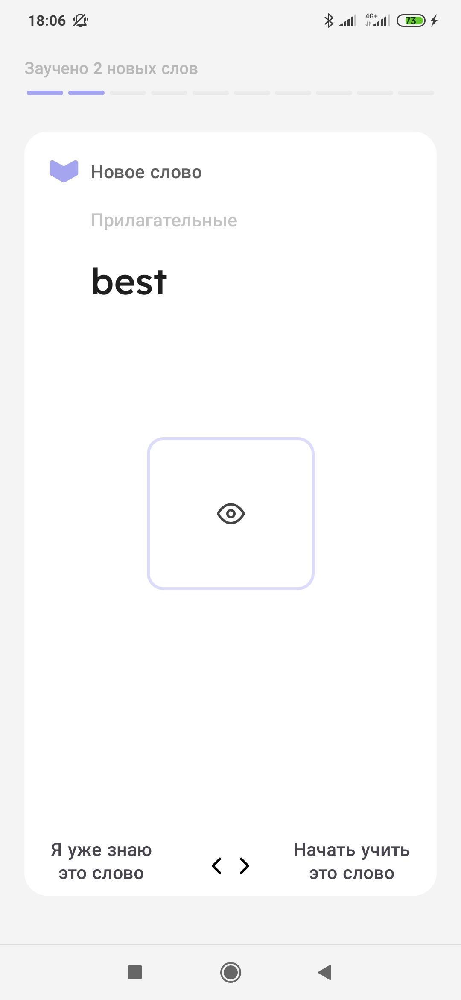

# LerWord [MVP,MOXY,Room,Coroutines]
This repository is an example of the implementation of the MVP pattern on Android with Moxy.

## Screenshots
Screenshot of each window

</img>
</img>
</img>

## Structure

#### Model
The model is presented in the form of two repositories that provide suspend functions for receiving data
- `UserRepository` - implemented using the Room library
- `WordsRepository` -implemented by a regular class, like a simulated database

#### View
View are classic activities
- `Activity` 
- `Adapter`
  
#### Presenter
ViewModels contain the logic of their screens
 - `LoginPresenter`
 - `SignUpPresenter`
 - `MainPresenter`
